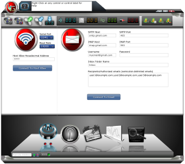
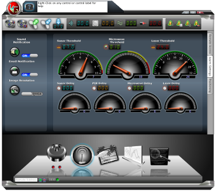
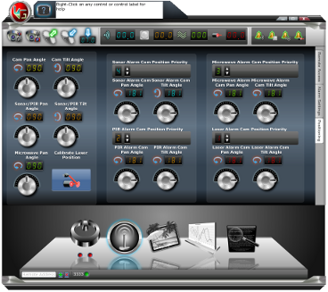
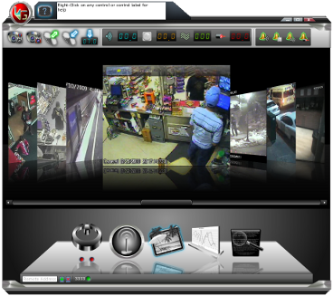
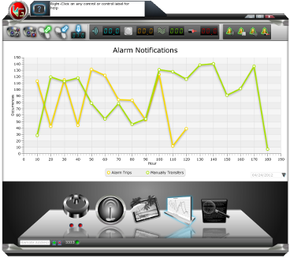

# ugate

<h1><u>Summary:</u></h1>

<b>UGate is a fully configurable indoor/outdoor security system that:</b>

<ul> <li><b>Takes pictures (w/night vision) and sends an email with the picture as an attachment to predefined recipient(s).</b> <ol> <li>Via alarm sensor(s) trip</li> <li>Via IR Remote Control</li> <li>Via GUI Application</li> <li>Via remote web interface (embedded web server in GUI Application)</li> <li>Via receiving an email with device commands (initiated from a computer, mobile phone, or any other device that can send emails/text messages).</li> </ol> </li> <li><b>Remotely pan/tilt on-board camera.</b> <ol> <li>Via IR Remote Control</li> <li>Via GUI Application</li> <li>Via remote web interface (embedded web server in GUI Application)</li> <li>Via receiving an email with device commands (initiated from a computer, mobile phone, or any other device that can send emails/text messages).</li> </ol> </li> <li><b>Remotely pan/tilt alarm sensor orientation.</b> <ol> <li>Via IR Remote Control (all sensors except microwave)</li> <li>Via GUI Application (all sensors- pan only for microwave)</li> <li>Via remote web interface (embedded web server in GUI Application)</li> <li>Via receiving an email with device commands (all sensors- initiated from a computer, mobile phone, or any other device that can send emails/text messages).</li> </ol> </li> <li><b>Remotely open/close an entrance gate (optional).</b> <ol> <li>Via IR Remote Control</li> <li>Via GUI Application</li> <li>Via remote web interface (embedded in GUI Application)</li> <li>Via receiving an email with device commands (initiated from a computer, mobile phone, or any other device that can send emails/text messages).</li> </ol> </li> </ul>
