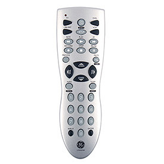

<section id="content">

## Core UGate Features

[†](#feature_dep)<table id="featuretable" cellspacing="0" cellpadding="10" border="0" width="100%" align="center"><tbody><tr><th width="17%" valign="center" align="center"></th><th width="16%" valign="center" align="center"></th><th width="16%" valign="center" align="center"></th><th width="16%" valign="center" align="center"></th><th width="16%" valign="center" align="center"></th><th width="16%" valign="center" align="center"></th></tr><tr><td>Adjust Access Privileges [*](#access_cred)</td><td valign="top" align="center"></td><td valign="top" align="center"></td><td valign="top" align="center"></td><td valign="top" align="center"></td><td valign="top" align="center"></td></tr><tr><td>Wireless Connection Settings</td><td valign="top" align="center"></td><td valign="top" align="center"></td><td valign="top" align="center"></td><td valign="top" align="center"></td><td valign="top" align="center"></td></tr><tr><td>Email Connection Settings</td><td valign="top" align="center"></td><td valign="top" align="center"></td><td valign="top" align="center"></td><td valign="top" align="center"></td><td valign="top" align="center"></td></tr><tr><td>Web Server Connection Settings</td><td valign="top" align="center"></td><td valign="top" align="center"></td><td valign="top" align="center"></td><td valign="top" align="center"></td><td valign="top" align="center"></td></tr><tr><td>Add/Change/Remove Wireless Connection Nodes [**](#wireless_node)</td><td valign="top" align="center"></td><td valign="top" align="center"></td><td valign="top" align="center"></td><td valign="top" align="center"></td><td valign="top" align="center"></td></tr><tr><td>View Wireless Connection Node Status [**](#wireless_node)</td><td valign="top" align="center"></td><td valign="top" align="center"></td><td valign="top" align="center"></td><td valign="top" align="center"></td><td valign="top" align="center"></td></tr><tr><td>Synchronize Wireless Node Settings With Database [***](#wireless_sync)</td><td valign="top" align="center"></td><td valign="top" align="center"></td><td valign="top" align="center"></td><td valign="top" align="center"></td><td valign="top" align="center"></td></tr><tr><td>Take Image Snapshots On-The-Fly</td><td valign="top" align="center"></td><td valign="top" align="center"></td><td valign="top" align="center"></td><td valign="top" align="center"></td><td valign="top" align="center"></td></tr><tr><td>Change Image Capture Resolution</td><td valign="top" align="center"></td><td valign="top" align="center"></td><td valign="top" align="center"></td><td valign="top" align="center"></td><td valign="top" align="center"></td></tr><tr><td>Toggle Desktop Alarm Sound Notifications</td><td valign="top" align="center"></td><td valign="top" align="center"></td><td valign="top" align="center"></td><td valign="top" align="center"></td><td valign="top" align="center"></td></tr><tr><td>Toggle Email Alarm Notifications [****](#email)</td><td valign="top" align="center"></td><td valign="top" align="center"></td><td valign="top" align="center"></td><td valign="top" align="center"></td><td valign="top" align="center"></td></tr><tr><td>Toggle Media Capture on Alarm</td><td valign="top" align="center"></td><td valign="top" align="center"></td><td valign="top" align="center"></td><td valign="top" align="center"></td><td valign="top" align="center"></td></tr><tr><td>Sonar Alarm Distance Threshold</td><td valign="top" align="center"></td><td valign="top" align="center"></td><td valign="top" align="center"></td><td valign="top" align="center"></td><td valign="top" align="center"></td></tr><tr><td>Sonar Delay Between Alarm Triggers</td><td valign="top" align="center"></td><td valign="top" align="center"></td><td valign="top" align="center"></td><td valign="top" align="center"></td><td valign="top" align="center"></td></tr><tr><td>PIR Delay Between Alarm Triggers</td><td valign="top" align="center"></td><td valign="top" align="center"></td><td valign="top" align="center"></td><td valign="top" align="center"></td><td valign="top" align="center"></td></tr><tr><td>Microwave Alarm Distance Threshold</td><td valign="top" align="center"></td><td valign="top" align="center"></td><td valign="top" align="center"></td><td valign="top" align="center"></td><td valign="top" align="center"></td></tr><tr><td>Microwave Delay Between Alarm Triggers</td><td valign="top" align="center"></td><td valign="top" align="center"></td><td valign="top" align="center"></td><td valign="top" align="center"></td><td valign="top" align="center"></td></tr><tr><td>Laser Trip-Wire Alarm Distance Threshold</td><td valign="top" align="center"></td><td valign="top" align="center"></td><td valign="top" align="center"></td><td valign="top" align="center"></td><td valign="top" align="center"></td></tr><tr><td>Laser Trip-Wire Delay Between Alarm Triggers</td><td valign="top" align="center"></td><td valign="top" align="center"></td><td valign="top" align="center"></td><td valign="top" align="center"></td><td valign="top" align="center"></td></tr><tr><td>Adjust Live Camera Positioning (Pan/Tilt)</td><td valign="top" align="center"></td><td valign="top" align="center"></td><td valign="top" align="center"></td><td valign="top" align="center"></td><td valign="top" align="center"></td></tr><tr><td>Adjust Camera Positioning (Pan/Tilt) That Will Be Used When A Sensor Triggers An Alarm [*****](#cam_pos_on_alarm)</td><td valign="top" align="center"></td><td valign="top" align="center"></td><td valign="top" align="center"></td><td valign="top" align="center"></td><td valign="top" align="center"></td></tr><tr><td>Adjust Live Sonar/PIR Armature Positioning (Pan/Tilt)</td><td valign="top" align="center"></td><td valign="top" align="center"></td><td valign="top" align="center"></td><td valign="top" align="center"></td><td valign="top" align="center"></td></tr><tr><td>Adjust Live Microwave Positioning (Pan)</td><td valign="top" align="center"></td><td valign="top" align="center"></td><td valign="top" align="center"></td><td valign="top" align="center"></td><td valign="top" align="center"></td></tr><tr><td>Calibrate Laser Trip-Wire Positioning (Pan/Tilt)</td><td valign="top" align="center"></td><td valign="top" align="center"></td><td valign="top" align="center"></td><td valign="top" align="center"></td><td valign="top" align="center"></td></tr><tr><td>Adjust Camera Positioning (Pan/Tilt)</td><td valign="top" align="center"></td><td valign="top" align="center"></td><td valign="top" align="center"></td><td valign="top" align="center"></td><td valign="top" align="center"></td></tr><tr><td>View Surveillance Media</td><td valign="top" align="center"></td><td valign="top" align="center"></td><td valign="top" align="center"></td><td valign="top" align="center"></td><td valign="top" align="center"></td></tr><tr><td>Control Multi-Alarm Trip State [******](#multi_alarm)</td><td valign="top" align="center"></td><td valign="top" align="center"></td><td valign="top" align="center"></td><td valign="top" align="center"></td><td valign="top" align="center"></td></tr><tr><td>View Alarm Sensor Readings</td><td valign="top" align="center"></td><td valign="top" align="center"></td><td valign="top" align="center"></td><td valign="top" align="center"></td><td valign="top" align="center"></td></tr><tr><td>View Historical Surveillance Trends</td><td valign="top" align="center"></td><td valign="top" align="center"></td><td valign="top" align="center"></td><td valign="top" align="center"></td><td valign="top" align="center"></td></tr><tr><td>Customize Web GUI</td><td valign="top" align="center"></td><td valign="top" align="center"></td><td valign="top" align="center"></td><td valign="top" align="center"></td><td valign="top" align="center"></td></tr><tr><td>Change/Disable Universal Remote Access Codes (per wireless node)</td><td valign="top" align="center"></td><td valign="top" align="center"></td><td valign="top" align="center"></td><td valign="top" align="center"></td><td valign="top" align="center"></td></tr><tr><td>Toggle Gate Access (optional when a gate is setup and present at the node)</td><td valign="top" align="center"></td><td valign="top" align="center"></td><td valign="top" align="center"></td><td valign="top" align="center"></td><td valign="top" align="center"></td></tr><tr><td>Toggle Opening/Closing Gate (optional when a gate is setup and present at the node)</td><td valign="top" align="center"></td><td valign="top" align="center"></td><td valign="top" align="center"></td><td valign="top" align="center"></td><td valign="top" align="center"></td></tr></tbody></table>[More Info](userguide.jsp)

_† NOTE: All devices are dependent upon the desktop application to be up and running (where the database resides)._

_* Access credentials are universal for all devices except the [iPhone](userguide.jsp#iPhone_Setup)/[Android](userguide.jsp#Android_Setup) applications. iPhone/Android access is done via Bluetooth pairing and can be restricted to individual devices using settings designated in the desktop application (only applies to the application running on the mobile- access via a web browser to the web server is independent of these changes). The [Web Server](userguide.jsp#Web_Server) requires a TLS connection which is aquired by either generating a self-signed certificate (included in the web server setup) or by selecting a certificate you have aquired (web server option requires [additional setup](http://ugate.org/userguide.jsp#Web_Server) to be accessible via the internet). The [universal remote](userguide.jsp#The_Universal_Remote:) uses a predefined 3-digit access key to operate the device and is considered the least secure device access (can be disabled)._

_** Wireless connection nodes (microcontrollers) allow for multiple security/surveillance locations_

_*** Wireless synchronization between devices (desktop, mobile, etc.) will always be done by transferring information from the desktop application's databse to the node(s). This is done automatically when the desktop application is started, but can also be initiated manually via designated devices._

_**** [Email](userguide.jsp#Email) alram notifications will send a snapshot image at the time of the alarm to all of the recipients designated in the email connection settings. Emails can also be received from predefined recipients that contain command codes executed in the order they are received._

_***** Each alarm sensor trigger has it's own [camera positioning (pan/tilt)](userguide.jsp#Command_Codes) that can be used when it triggers an alarm. A priority numbering sequence is used in cases where multiple alarms are triggered simultaneously. It will be used to determine what position the camera should assume when an alarm is triggered. The default for each alarm sensor is to maintain the current camera position that was held prior to the alarm trigger._

_****** [Multi-Alarm Trip State](userguide.jsp#Settings_Indexes) indicates which combination of alarm sensors need to be triggered in order to signal an alarm._
</section>
